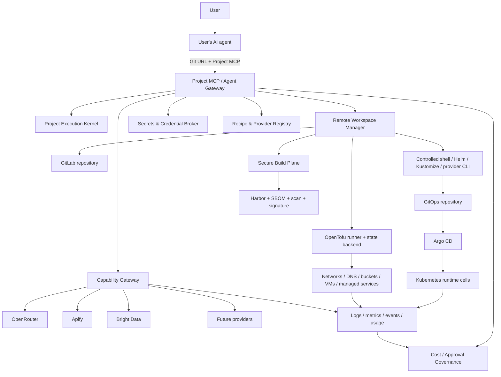

# AI-native DevOps Platform — migration README и TDD specification

**Статус документа:** целевая архитектура и план миграции после Iterations 1–7  
**Исходная база:** `ai-native-paas-final.zip`  
**Цель:** превратить существующий AI-native PaaS в **управляемую удалённую DevOps-среду для AI-агентов**, где пользователь передаёт агенту Git URL и Project MCP, а агент сам проектирует, разворачивает и сопровождает систему через Git, OpenTofu, Bash, Helm/Kustomize и Argo CD.

---

## 1. Коротко: что именно мы строим

Пользовательский контракт должен выглядеть так:

```text
1. Пользователь нажимает Create Project.
2. Платформа создаёт Git repository, state namespace, secret namespace,
   GitOps path, workspace policy и Project MCP endpoint.
3. Пользователь передаёт Git URL и MCP URL своему AI-агенту.
4. Пользователь говорит: «Задеплой. Нужны PostgreSQL, Temporal,
   Qdrant, OpenRouter и домен api.example.com».
5. Агент создаёт remote workspace, анализирует repository,
   пишет Dockerfile/Helm/OpenTofu, строит plan, получает approval,
   применяет инфраструктуру, коммитит GitOps и ждёт Argo CD.
6. Агент проверяет logs, events, health и HTTP, исправляет ошибки
   в новой ветке/коммите и возвращает рабочие URL.
```

Продукт больше не обязан иметь встроенную универсальную сущность для каждой технологии. Kafka, RabbitMQ, Temporal, Qdrant, ClickHouse или новый проект из GitHub устанавливаются стандартными средствами экосистемы:

```text
OpenTofu provider/module
Helm chart
Kustomize
Kubernetes operator
OCI image
controlled installation script
external provider API
```

Платформа контролирует не список разрешённых технологий, а **условия безопасного исполнения**:

```text
identity
project scope
short-lived credentials
isolated workspace
network policy
resource limits
plan validation
cost estimation
human approval
GitOps ownership
audit
usage accounting
```

Продуктовая формула:

```text
Git repository
+
Project MCP
+
Ephemeral remote workspace
+
OpenTofu / controlled Bash / Helm / Kustomize
+
GitOps / Argo CD
+
Secrets and credential broker
+
Provider and capability gateway
+
Cost, approval and audit governance
```

---

## 2. Что меняется относительно старого vision

### Было

```text
SourceRevision
    ↓
Buildpacks / Dockerfile
    ↓
ArtifactRef
    ↓
PaaS Release
    ↓
PaaSApp CRD
    ↓
ServiceInstance / ServiceBinding
    ↓
Ready URL
```

Control plane стремился понимать каждый workload и dependency как собственную PaaS-сущность.

### Стало

```text
User intent
    ↓
Project MCP
    ↓
Remote workspace
    ├── Git
    ├── OpenTofu
    ├── Bash
    ├── Helm
    ├── Kustomize
    └── provider CLIs
    ↓
Plan + policy + cost
    ↓
Human approval where required
    ↓
OpenTofu apply + GitOps commit
    ↓
Argo CD
    ↓
Kubernetes / VMs / managed providers / external APIs
```

Новая архитектура не отменяет прошлую работу. Она меняет роли доменов:

```text
Iteration 1  Platform Kernel
             → Project Execution Kernel

Iteration 2  Source Control
             → Source + IaC + GitOps history and change management

Iteration 3  Build & Artifact
             → Secure generic build and software-supply-chain executor

Iteration 4  Runtime Delivery
             → Generic GitOps environment delivery; PaaSApp becomes optional

Iteration 5  Application Attachments
             → Secrets/Credentials + Recipe/Provider Registry + Capability Gateway

Iteration 6  Commercial Governance
             → Pre-execution cost, quota and usage governance

Iteration 7  Agent Governance
             → Central Project MCP and Remote Workspace Orchestrator
```

---

## 3. Целевая архитектура



### Источники истины

```text
Application source, IaC and GitOps intent    → Git repositories
OpenTofu resource mapping                    → encrypted remote state + lock
OCI artifact                                 → Harbor repository@sha256:digest
Kubernetes desired state                     → GitOps repository
Kubernetes observed state                    → Kubernetes API / Argo status
Secret values                                → OpenBao or equivalent secret store
Provider credentials                         → credential broker / provider vault
Approvals and operations                     → Kernel/Agent PostgreSQL schemas
Usage and billable facts                     → append-only usage ledger
```

**Bash никогда не является источником истины.** Команда может выполнить discovery, build, migration или bootstrap, но устойчивое состояние после неё должно быть зафиксировано в Git, OpenTofu state, provider API, secret store или operation ledger.

---

## 4. Целевая модель Project

```text
Project
├── Git repository
├── Environments
│   ├── preview/*
│   ├── staging
│   └── production
├── Workspace policy
├── OpenTofu state namespace
├── GitOps destination
├── Secret namespace
├── Provider connections
├── Capability bindings
├── Budget policy
└── Project MCP endpoint
```

Минимальный `platform.yaml`:

```yaml
apiVersion: platform.example.com/v2
kind: Project

metadata:
  name: booking-platform

spec:
  environments:
    - name: staging
      approvalPolicy: automatic
    - name: production
      approvalPolicy: required

  workspace:
    image: registry.example.com/platform/devops-workspace@sha256:...
    cpu: "2"
    memory: 4Gi
    timeout: 45m
    networkProfile: public-package-registries

  infrastructure:
    engine: opentofu
    root: infrastructure/tofu
    stateBackend: platform

  gitops:
    root: deploy/environments
    engine: argocd

  build:
    defaultDriver: dockerfile
    supplyChainPolicy: signed-production

  policy:
    forbidClusterScopedResources: true
    productionRequiresApproval: true
    destructiveApplyRequiresApproval: true
    monthlyCostApprovalThreshold: 10000 # minor currency units
```

Предлагаемая структура repository:

```text
project/
├── apps/
│   ├── api/
│   ├── frontend/
│   └── worker/
├── infrastructure/
│   ├── tofu/
│   └── modules/
├── deploy/
│   ├── base/
│   └── environments/
│       ├── staging/
│       └── production/
├── recipes.lock.yaml
├── platform.yaml
└── README.md
```

---

## 5. Project MCP v2

Новый MCP должен быть построен вокруг проекта и удалённого execution loop.

### Project и repository

```text
project_create
project_get
project_get_policy
repository_status
repository_diff
repository_apply_patch
repository_create_branch
repository_commit
repository_push
repository_create_merge_request
```

### Workspace

```text
workspace_create
workspace_get
workspace_exec
workspace_upload_artifact
workspace_cancel_command
workspace_destroy
```

### Infrastructure

```text
infra_init
infra_validate
infra_plan
infra_get_plan
infra_apply
infra_destroy
infra_state_list
infra_import
```

### Build и supply chain

```text
build_execute
build_get
artifact_get
artifact_verify
```

### GitOps и runtime

```text
gitops_validate
gitops_commit
argocd_sync
argocd_get_status
argocd_rollback
deployment_get_logs
deployment_get_events
deployment_http_probe
```

### Secrets, providers and capabilities

```text
secret_set
secret_list_metadata
credential_request
credential_revoke
recipe_search
recipe_get
provider_connect
provider_plan_resource
capability_bind
capability_get_usage
```

### Governance

```text
cost_estimate
approval_request
approval_get
operation_get
operation_wait
operation_cancel
usage_get
```

### Что намеренно отсутствует

```text
platform_get_cluster_admin_kubeconfig
platform_get_openbao_root_token
platform_get_gitlab_admin_token
platform_get_cloud_root_credentials
platform_read_secret_value
platform_unrestricted_shell_on_control_plane
```

`workspace_exec` разрешён только внутри ephemeral workspace с project-scoped identity, resource quota, egress policy, timeout и полным audit.

---

## 6. Совместимость MCP v1

На период миграции v1 не удаляется мгновенно. Добавляется compatibility layer:

```text
platform_create_project
    → project_create

platform_apply_repository_patch
    → repository_apply_patch

platform_request_build
    → build_execute

platform_deploy
    → high-level orchestration:
       build_execute + gitops_validate + approval + gitops_commit + argocd_sync

platform_set_secret
    → secret_set

platform_provision_service
    → recipe_search + provider_plan_resource + infra_plan/apply

platform_bind_service
    → credential_request + environment input update

platform_add_domain
    → provider_plan_resource(DNS) + infra_plan/apply + gitops update
```

Deprecated methods должны возвращать warning metadata и иметь sunset version. Они не могут обходить новые policy/cost/approval gates.

---

## 7. Общая TDD-методика v2

Для каждого теста используется единый формат:

```text
ID
Test name
Level: domain | application | contract | PostgreSQL | provider | system | fuzz | chaos
Given
When
Then
Fault injection, если применимо
```

### Обязательные категории

```text
1. Pure domain tests
2. Application orchestration tests with fakes/spies
3. Contract/golden tests
4. Live PostgreSQL tests
5. Provider contract tests
6. Real provider lab tests
7. Kubernetes/Argo system tests
8. Fuzz/property tests
9. Race/concurrency tests
10. Chaos and recovery tests
```

### Общие fixtures

```text
test/fixtures/projects/hello-go
test/fixtures/projects/node-monorepo
test/fixtures/projects/temporal-qdrant-stack
test/fixtures/projects/existing-helm
test/fixtures/projects/existing-tofu
test/fixtures/projects/malicious-dockerfile
test/fixtures/projects/secret-in-git
test/fixtures/projects/forbidden-cluster-role
test/fixtures/projects/destructive-tofu-plan
test/fixtures/projects/provider-timeout
test/fixtures/projects/workspace-exfiltration
```

### Универсальный secret sentinel

Каждый test/acceptance flow, который использует секрет, создаёт уникальное значение:

```text
SECRET_SENTINEL_<test-id>_<random>
```

После выполнения тест проверяет его отсутствие в:

```text
HTTP responses
public errors
stdout/stderr
workspace command metadata
audit
outbox
Git commits
OpenTofu plan JSON
GitOps YAML
build metadata
OCI labels
logs
metrics labels
usage events
```

### Общие architecture tests

```text
TestArchitecture_DomainImportsOnlyPublishedContracts
TestArchitecture_NoCrossSchemaForeignKeys
TestArchitecture_NoCrossSchemaSQLReads
TestArchitecture_WorkspaceCannotImportControlPlaneInternals
TestArchitecture_ProviderAdaptersCannotBypassGovernancePorts
TestArchitecture_NoProductionCodeReadsSecretValuesBack
TestArchitecture_NoDirectKubectlFromControlPlaneHandlers
```

---

# 8. Iteration 1 → Project Execution Kernel

## 8.1. Что оставить

Без изменений по смыслу:

```text
Organizations
Memberships
Principals
Authorization
Idempotency
Operations
Transactional outbox/inbox
Append-only audit
Stable public errors
```

## 8.2. Что изменить

Операция теперь должна моделировать не только PaaS command, но и длинный DevOps workflow:

```text
PENDING
→ RUNNING
→ WAITING_DEPENDENCY
→ WAITING_APPROVAL
→ RUNNING
→ SUCCEEDED | FAILED | CANCELED
```

Добавляются:

```text
Project-scoped service principals
Workspace principals
Short-lived credential leases
Parent/child operation graph
Policy decision reference
Approval wait state
Cancellation propagation
Operation checkpoints
```

Kernel не должен знать, что такое OpenTofu, Argo или GitLab. Он знает только operation, actor, tenant/project scope, state, dependencies и durable events.

## 8.3. Новые/изменённые контракты

```go
type ResourceScope struct {
    TenantID  string
    ProjectID string
    EnvID     string
}

type CredentialLeaseRef struct {
    LeaseID   string
    Scope     ResourceScope
    Kind      string
    ExpiresAt time.Time
}

type OperationRef struct {
    OperationID      string
    ParentOperationID string
    CorrelationID    string
    CausationID      string
}
```

## 8.4. Implementation backlog

1. Расширить operation state machine.
2. Добавить parent-child operation relation без cross-domain FK.
3. Добавить `CredentialLease` metadata; secret/token value хранится у credential broker.
4. Добавить policy decision envelope.
5. Добавить cancellation fan-out через outbox events.
6. Запретить development identity headers в production profile.
7. Подключить OIDC/mTLS verifier до HTTP handlers.
8. Ввести migration lock для multi-replica startup.

## 8.5. TDD specification

### K1. `TestKernel_ProjectScopedPrincipalCannotCrossProject`

**Level:** domain + application  
**Given:** service principal имеет tenant `t1`, project `p1`, scopes `workspace:exec`.  
**When:** он вызывает command для `p2` того же tenant.  
**Then:** `PERMISSION_DENIED`; domain handler и external ports не вызываются; failed authorization попадает в audit без request secrets.

### K2. `TestKernel_WorkspacePrincipalCannotEscalateToTenantScope`

**Level:** domain  
**Given:** workspace principal создан с scope `project:p1/environment:staging`.  
**When:** tool arguments содержат `tenant_id=t1`, `project_id=p2` или wildcard.  
**Then:** authorization использует verified principal context, а не body; escalation отклоняется.

### K3. `TestKernel_CredentialLeaseExpiresAndCannotBeReused`

**Level:** domain + fake clock  
**Given:** lease действителен до `T+10m`.  
**When:** command вызывается в `T+9m` и затем в `T+11m`.  
**Then:** первый разрешён, второй отклонён `CREDENTIAL_EXPIRED`; replay старой invocation не продлевает lease.

### K4. `TestKernel_OperationWaitsForApprovalWithoutRepeatingSideEffect`

**Level:** application  
**Given:** operation успела создать external plan и вошла в `WAITING_APPROVAL`.  
**When:** worker restart вызывает resume.  
**Then:** plan provider не вызывается повторно; operation продолжает ожидание; после approval продолжает с checkpoint.

### K5. `TestKernel_ParentCancellationPropagatesToCancelableChildren`

**Level:** application  
**Given:** parent deploy operation имеет child build, plan и GitOps operations.  
**When:** пользователь отменяет parent.  
**Then:** cancel event отправляется только non-terminal/cancelable children; completed child не мутируется; parent завершает `CANCELED` после acknowledgements.

### K6. `TestKernel_IdempotentCommandReturnsOriginalOperationGraph`

**Level:** application + concurrency  
**Given:** 32 concurrent requests с одинаковыми idempotency key и canonical payload.  
**When:** они создают project workflow.  
**Then:** создаётся один parent operation и один набор child operations; всем callers возвращается одна identity.

### K7. `TestKernel_IdempotencyPayloadMismatchCannotReuseApproval`

**Level:** domain  
**Given:** key был использован для plan hash `A`.  
**When:** тот же key приходит с plan hash `B`.  
**Then:** `IDEMPOTENCY_CONFLICT`; approval или result для `A` не возвращается.

### K8. `TestKernel_OutboxCommitThenCrashPublishesExactlyOnceEffect`

**Level:** PostgreSQL + broker integration  
**Given:** aggregate и outbox event закоммичены; процесс падает до HTTP response.  
**When:** dispatcher восстанавливается и broker повторяет delivery.  
**Then:** event может быть доставлен повторно, но consumer effect один благодаря inbox/idempotency.

### K9. `TestKernel_AuditRedactsWorkspaceCommandSecrets`

**Level:** application  
**Given:** command содержит environment variable и stdin с secret sentinel.  
**When:** invocation succeeds/fails.  
**Then:** audit сохраняет command template, actor, scope, outcome и hashes, но sentinel отсутствует во всех serialized fields.

### K10. `TestKernel_ServicePrincipalCannotApproveHumanAction`

**Level:** domain  
**Given:** service/workspace principal имеет широкий technical scope.  
**When:** он вызывает approval grant для destructive apply.  
**Then:** denied; approver должен быть verified human principal с policy scope.

### K11. `TestKernel_ProductionProfileRejectsDevelopmentIdentityHeaders`

**Level:** HTTP integration  
**Given:** production profile без test auth middleware.  
**When:** request передаёт `X-Tenant-ID` и `X-Principal-ID` без valid OIDC/mTLS.  
**Then:** `401`; handler не исполняется.

### K12. `TestKernel_OIDCAndMTLSIdentityCannotBeConfused`

**Level:** identity provider integration  
**Given:** OIDC user token и mTLS service certificate.  
**When:** claims/certificate пытаются заявить другой principal kind.  
**Then:** kind определяется trusted verifier configuration; unsigned/body values игнорируются.

### K13. `TestPostgres_ConcurrentMigrationStartupUsesOneOwner`

**Level:** live PostgreSQL  
**Given:** пять replicas запускают migrations одновременно.  
**When:** schema требует upgrade.  
**Then:** advisory lock выбирает одного migrator; остальные ждут/проверяют checksum; schema применена один раз.

### K14. `TestKernel_OperationCheckpointSurvivesDatabaseFailover`

**Level:** chaos + PostgreSQL  
**Given:** operation записала checkpoint `PLAN_CREATED`.  
**When:** primary failover происходит до следующего step.  
**Then:** worker resume читает checkpoint и не повторяет provider side effect.

## 8.6. Exit gate

```text
All original Iteration 1 tests remain green
New K1–K14 green
OIDC/mTLS production identity green
Live PostgreSQL + migration lock green
Real broker outbox/inbox recovery green
```

---

# 9. Iteration 2 → Source, IaC and GitOps Change Management

## 9.1. Что оставить

```text
GitLab provisioning
numeric provider identity
repositories, branches and merge requests
webhook ingestion
periodic reconciliation
secure local Git workspace
exact SourceRevision
path traversal and symlink protection
```

## 9.2. Что изменить

Git становится хранителем не только application source, но и:

```text
Dockerfiles
OpenTofu
Helm/Kustomize
Argo Applications
provider configuration
runbooks
agent decisions and plan summaries
```

Новые сущности:

```text
ChangeSet
ProtectedPathPolicy
CommitAttestation
InfrastructurePlanComment
RepositoryTemplateVersion
EnvironmentBranchPolicy
```

Production IaC/GitOps paths должны иметь более строгую policy, чем обычный source code.

## 9.3. Implementation backlog

1. Добавить repository bootstrap template v2.
2. Добавить protected path rules для `infrastructure/**`, `deploy/environments/production/**`, `.gitlab/**`.
3. Добавить signed/attested agent commits.
4. Добавить operation/task/correlation trailers.
5. Добавить plan summary comment в MR.
6. Добавить pre-commit secret scanning.
7. Добавить branch/base-SHA optimistic concurrency.
8. Добавить two-phase archive project/repository.
9. Добавить LFS/submodule explicit policy.
10. Подключить real GitLab acceptance suite.

## 9.4. TDD specification

### S1. `TestSource_CreateProjectBootstrapsV2RepositoryLayout`

**Level:** application + GitLab contract  
**Given:** новый project и template version `v2`.  
**When:** repository provisioning завершается.  
**Then:** repo содержит `platform.yaml`, `infrastructure/tofu`, `deploy/environments`, `.gitignore`, README; commit SHA сохранён как bootstrap revision.

### S2. `TestSource_CheckoutUsesExactCommitNotMutableBranchHead`

**Level:** real local Git integration  
**Given:** branch `main` перемещается с SHA A на B после task creation.  
**When:** workspace checkout получает SourceRevision A.  
**Then:** checked-out tree соответствует A; B не подмешивается.

### S3. `TestSource_PatchRejectsNonCanonicalAndGitInternalPaths`

**Level:** fuzz + application  
**Given:** patch paths с `..`, repeated separators, invalid UTF-8, backslash, `.git`, symlink escape.  
**When:** agent применяет patch.  
**Then:** request rejected before filesystem mutation; no partial files remain.

### S4. `TestSource_ProductionGitOpsPathRequiresApprovalPolicy`

**Level:** application  
**Given:** agent scope позволяет source edits, но production path требует human approval.  
**When:** patch меняет `deploy/environments/production`.  
**Then:** создаётся approval request; commit/push не выполняется до matching grant.

### S5. `TestSource_AgentCommitContainsSignedAttestationAndCorrelation`

**Level:** Git integration  
**Given:** task `tsk1`, operation `op1`, actor `agent1`.  
**When:** commit создаётся.  
**Then:** commit содержит verified signature/attestation и trailers `Task-ID`, `Operation-ID`, `Actor-ID`; secret values отсутствуют.

### S6. `TestSource_ConcurrentPushUsesExpectedBaseSHA`

**Level:** Git integration + concurrency  
**Given:** два agents начинают с base A.  
**When:** первый пушит B, второй пытается пушить C с expected A.  
**Then:** второй получает stable conflict; blind force push невозможен.

### S7. `TestSource_SecretScannerBlocksCredentialBeforeCommit`

**Level:** application  
**Given:** patch добавляет provider key sentinel.  
**When:** commit requested.  
**Then:** commit не создаётся; error не повторяет key; audit содержит rule ID и file path only.

### S8. `TestSource_ProjectTokenCannotReadSiblingRepository`

**Level:** real GitLab provider  
**Given:** token project `p1`.  
**When:** он клонирует `p2` в том же tenant.  
**Then:** GitLab denies; token scopes не включают group-wide/admin access.

### S9. `TestSource_MissedWebhookRecoveredByBranchReconciler`

**Level:** application + provider fake  
**Given:** GitLab branch head B, observed head A, webhook потерян.  
**When:** periodic reconciler runs.  
**Then:** exactly one `source.revision_observed.v2` emitted for B.

### S10. `TestSource_OutOfOrderWebhookCannotRegressObservedHead`

**Level:** application  
**Given:** events for B then A arrive.  
**When:** both processed.  
**Then:** head remains B; old event recorded as stale/no-op.

### S11. `TestSource_RenameKeepsNumericProviderIdentity`

**Level:** real GitLab provider  
**Given:** project path renamed/transferred.  
**When:** reconciliation runs.  
**Then:** internal repository identity remains bound to numeric GitLab project ID; new path updates metadata only.

### S12. `TestSource_MergeRequestPublishesPlanSummaryWithoutSecrets`

**Level:** GitLab contract  
**Given:** OpenTofu plan summary with resource changes, cost range and secret-sensitive values.  
**When:** platform comments on MR.  
**Then:** comment lists create/update/delete and cost, but masks sensitive values and provider tokens.

### S13. `TestSource_DeletedBranchProducesEnvironmentCleanupIntent`

**Level:** application  
**Given:** preview branch was mapped to environment.  
**When:** branch deletion observed.  
**Then:** source emits cleanup intent; it does not directly delete runtime resources.

### S14. `TestSource_SubmoduleAndLFSFollowExplicitPolicy`

**Level:** integration  
**Given:** repo references submodule and LFS objects.  
**When:** policy disables them.  
**Then:** checkout fails with stable user error before external fetch. When enabled, only allow-listed origins and quotas apply.

### S15. `TestSource_GitLab429UsesBoundedRetryAndPreservesIdempotency`

**Level:** provider contract  
**Given:** GitLab returns `429` with retry information after project create.  
**When:** operation resumes.  
**Then:** bounded retry/discovery occurs; duplicate project is not created.

### S16. `TestSource_ProjectArchiveIsTwoPhaseAndReversibleBeforePurge`

**Level:** application + provider  
**Given:** active project.  
**When:** archive requested.  
**Then:** mutations stop, GitLab project archives, state retained. Before purge deadline, unarchive restores access; purge is separate approved action.

### S17. `TestSource_CheckoutCredentialRemovedFromDiskAndGitConfig`

**Level:** real Git integration  
**Given:** short-lived clone/push credential.  
**When:** workspace completes or crashes.  
**Then:** credential absent from remote URL, config, files, process environment dump and workspace archive.

### S18. `TestSource_UnknownProviderProjectIsQuarantinedNotAdopted`

**Level:** reconciliation  
**Given:** GitLab contains project matching path but without expected platform external identity/labels.  
**When:** reconciler discovers it.  
**Then:** resource quarantined; not automatically bound to tenant.

## 9.5. Exit gate

```text
Original Source Control requirements mapped 100%
S1–S18 green
Real GitLab create/rename/transfer/archive/token tests green
No secret or persistent credential in repository/workspace
```

---

# 10. Iteration 3 → Secure Generic Build & Supply Chain Executor

## 10.1. Что оставить

```text
exact commit checkout
OCI registry
immutable digest
SBOM
vulnerability scan
signature
provenance
cache isolation
build secret separation
Dockerfile VM boundary
build state machine and idempotency
```

## 10.2. Что изменить

Runtime auto-detection больше не является центром продукта. Preferred path:

```text
agent writes explicit Dockerfile/build config
    or
agent selects buildpacks/Nix/custom driver
```

Build plane должен безопасно выполнить explicit `BuildSpec`, а не угадывать архитектуру приложения.

```go
type BuildSpec struct {
    Driver          string // dockerfile | buildpacks | nix | custom-approved
    ContextRoot     string
    DefinitionPath  string
    Platforms       []string
    BuildArgs       map[string]string
    SecretRefs      []string
    NetworkProfile  string
    ResourceClass   string
}
```

## 10.3. Implementation backlog

1. Добавить versioned `BuildSpec` и hash в build identity.
2. Сделать detector optional helper.
3. Сохранить Dockerfile builds только в disposable VM/sandbox.
4. Добавить egress profiles и deny metadata/private networks.
5. Добавить OCI provenance attestation.
6. Добавить multi-arch manifest support.
7. Добавить build plan/cost estimate до execution.
8. Добавить recovery по exact registry digest.

## 10.4. TDD specification

### B1. `TestBuild_IdentityIncludesCommitAndCanonicalBuildSpec`

**Level:** domain  
**Given:** same SHA with different Dockerfile path/network profile/platforms.  
**When:** identities calculated.  
**Then:** distinct builds; semantically equivalent normalized specs produce same identity.

### B2. `TestBuild_ExplicitBuildSpecOverridesRuntimeDetection`

**Level:** application  
**Given:** repo contains Node and Go markers, BuildSpec selects Dockerfile.  
**When:** build starts.  
**Then:** detector does not choose another driver.

### B3. `TestBuild_BuildpacksRemainOptionalFallback`

**Level:** application  
**Given:** no explicit spec and project policy allows auto mode.  
**When:** supported app submitted.  
**Then:** buildpacks selected; detected configuration is persisted/audited.

### B4. `TestBuild_DockerfileRunsOnlyInDisposableIsolationBackend`

**Level:** application  
**Given:** untrusted Dockerfile.  
**When:** build requested.  
**Then:** VM/sandbox backend selected; shared privileged Docker socket never used.

### B5. `TestBuild_NetworkProfileBlocksMetadataPrivateAndControlPlane`

**Level:** provider/system security  
**Given:** malicious build curls metadata, RFC1918, Kubernetes API and control-plane DNS.  
**When:** build executes.  
**Then:** connections denied and logged; public allow-listed package registries remain reachable.

### B6. `TestBuild_ResourceLimitsTerminateForkBombAndOversizedContext`

**Level:** system  
**Given:** fork bomb, inode bomb and context beyond limit.  
**When:** build runs.  
**Then:** terminated by PID/CPU/memory/inode/time quota; classified as user failure; worker survives.

### B7. `TestBuild_SecretsNeverEnterLayerLogOrProvenance`

**Level:** integration  
**Given:** build secret sentinel mounted for dependency fetch.  
**When:** image exported.  
**Then:** sentinel absent from layers, history, config, logs, SBOM, provenance and cache metadata.

### B8. `TestBuild_CacheIsProjectScopedForUntrustedLayers`

**Level:** integration  
**Given:** project A caches layer containing unique marker.  
**When:** project B builds similar context.  
**Then:** B cannot read A cache; only explicitly trusted global base layers are shared.

### B9. `TestBuild_RegistryPushResponseLostRecoversByDigestDiscovery`

**Level:** registry integration  
**Given:** push succeeds, response lost.  
**When:** worker resumes.  
**Then:** it resolves content digest, records artifact once and does not rebuild/push duplicate logical artifact.

### B10. `TestBuild_TrustChainRequiredBeforeArtifactReleasable`

**Level:** domain + PostgreSQL  
**Given:** artifact has image digest but missing SBOM/scan/signature.  
**When:** release policy queried.  
**Then:** not releasable until all immutable records pass.

### B11. `TestBuild_MutableBaseOrOutputTagCannotDefineProductionArtifact`

**Level:** policy  
**Given:** spec references mutable base/tag only.  
**When:** production policy evaluates.  
**Then:** base resolved/pinned to digest or build rejected; output reference always digest.

### B12. `TestBuild_SameIdentityConcurrentRequestsExecuteOnce`

**Level:** PostgreSQL + concurrency  
**Given:** 20 concurrent requests same identity.  
**When:** accepted.  
**Then:** one execution lease and one artifact; callers observe same operation.

### B13. `TestBuild_CancelStopsExecutionAndRevokesBuildCredentials`

**Level:** application/system  
**Given:** running build with temporary registry/source credentials.  
**When:** operation canceled.  
**Then:** backend terminates, leases revoked, partial artifact quarantined, state terminal `CANCELED`.

### B14. `TestBuild_MultiArchManifestContainsOnlyVerifiedPlatformDigests`

**Level:** registry integration  
**Given:** amd64 succeeds and arm64 fails scan.  
**When:** manifest list publication attempted.  
**Then:** production artifact not releasable; failed platform cannot be silently omitted unless policy explicitly allows.

### B15. `TestBuild_ProvenanceBindsSourceSpecBuilderAndOutputDigest`

**Level:** contract/crypto  
**Given:** completed build.  
**When:** provenance verified.  
**Then:** source SHA, BuildSpec hash, builder digest, timestamps and output digest are cryptographically bound; mutation invalidates verification.

## 10.5. Exit gate

```text
B1–B15 green
real kpack/buildpacks green for supported fast path
real Harbor/scanner/signing green
malicious-build isolation suite green
production deploy accepts only verified digest
```

---

# 11. Iteration 4 → Generic GitOps Environment Delivery

## 11.1. Что оставить

```text
GitOps repository
Argo CD
ApplicationSet
AppProject isolation
runtime cells
rollout/health observation
rollback by Git revision
PaaSApp operator for simple workloads
gVisor/Cilium/runtime security
```

## 11.2. Что изменить

`PaaSApp` перестаёт быть обязательным универсальным форматом. Основной путь поддерживает стандартные GitOps assets:

```text
HelmRelease or rendered Helm values
Kustomization
Argo CD Application
ApplicationSet
product-specific CRs/operators
plain namespaced Kubernetes resources allowed by policy
```

`PaaSApp` сохраняется как optional fast path для:

```text
simple web service
worker
cron job
basic autoscaling
standard generated domain
```

Новые сущности:

```text
GitOpsTarget
EnvironmentRevision
ArgoApplicationRef
WorkloadInventory
PolicyValidationResult
DeploymentObservation
```

Runtime Delivery отвечает за safe delivery и observation, а не за моделирование внутренностей Kafka/Temporal/Qdrant.

## 11.3. Implementation backlog

1. Добавить generic GitOps validation pipeline.
2. Поддержать Helm и Kustomize render/validation.
3. Добавить policy engine для kinds, namespaces, images, security context и network exposure.
4. Разделить platform-owned и project-owned GitOps paths.
5. Создавать строгий Argo `AppProject` на project/environment boundary.
6. Добавить workload inventory и status aggregation.
7. Сохранить `PaaSApp` как versioned adapter, не как mandatory core.
8. Добавить rollback через revert/promotion commit.
9. Запретить production direct apply вне emergency break-glass procedure.

## 11.4. TDD specification

### R1. `TestGitOps_CommitMayModifyOnlyProjectEnvironmentPath`

**Level:** application  
**Given:** project `p1`, environment `staging`.  
**When:** change set включает path другого project/cell или platform system path.  
**Then:** validation fails before Git commit; no partial commit.

### R2. `TestGitOps_HelmRenderIsDeterministicForPinnedInputs`

**Level:** integration/golden  
**Given:** pinned chart digest/version, values and capabilities.  
**When:** render выполняется дважды.  
**Then:** normalized resources byte-equivalent; network/time не влияют.

### R3. `TestGitOps_KustomizeRenderIsDeterministicAndPathSafe`

**Level:** integration/fuzz  
**Given:** Kustomize root with attempted `../` reference or remote unpinned base.  
**When:** validation runs.  
**Then:** unsafe reference rejected; pinned local configuration renders deterministically.

### R4. `TestGitOps_ForbiddenClusterScopedResourceRejectedBeforeCommit`

**Level:** policy  
**Given:** project manifest creates `ClusterRole`, `CRD`, `Node` or `StorageClass`.  
**When:** generic GitOps validation runs.  
**Then:** rejected unless explicit platform recipe/policy grants exact kind/name; no Argo sync.

### R5. `TestGitOps_PrivilegedWorkloadRejectedRegardlessOfHelmSource`

**Level:** policy  
**Given:** Helm chart renders privileged pod, hostPath or hostNetwork.  
**When:** validate.  
**Then:** rejected even if chart is curated; policy evaluates rendered objects.

### R6. `TestArgoProject_AllowsOnlyExpectedRepositoryClusterAndNamespaces`

**Level:** manifest contract + real Argo  
**Given:** project AppProject.  
**When:** Application references foreign repo, cluster or namespace.  
**Then:** Argo denies sync.

### R7. `TestRuntime_ArgoSyncedWithoutHealthyWorkloadsIsNotReady`

**Level:** application/system  
**Given:** Argo reports `Synced`, but deployment readiness fails.  
**When:** status aggregation runs.  
**Then:** environment remains `DEGRADED/ROLLING_OUT`, never `READY`.

### R8. `TestRuntime_RollbackCreatesAuditableGitRevision`

**Level:** application + Git  
**Given:** production revision B is bad and previous A is healthy.  
**When:** rollback requested.  
**Then:** new revert/promotion commit C references A; direct cluster mutation not used; audit connects B→C→A content.

### R9. `TestRuntime_DriftIsReportedAndSelfHealFollowsPolicy`

**Level:** system  
**Given:** manual kubectl changes replica/image.  
**When:** Argo detects drift.  
**Then:** policy either self-heals and emits audit or leaves explicit degraded state; drift is never silently accepted as desired state.

### R10. `TestRuntime_NamespaceAndServiceAccountIsolation`

**Level:** Kubernetes system  
**Given:** workload in project A.  
**When:** it accesses project B namespace or Kubernetes API.  
**Then:** RBAC/network denies; service account token absent unless exact recipe requires scoped one.

### R11. `TestRuntime_HPAAndGitOpsDoNotFightOverReplicas`

**Level:** system  
**Given:** HPA owns replicas.  
**When:** HPA scales and Argo syncs.  
**Then:** Argo ignore rule prevents replica reset; no reconcile loop.

### R12. `TestRuntime_ProductOperatorCRAllowedOnlyByRecipePolicy`

**Level:** policy  
**Given:** Temporal/Kafka/Qdrant operator CR.  
**When:** associated signed recipe allows exact group/kind and namespace.  
**Then:** accepted; same CR from untrusted custom path without policy rejected if elevated capabilities required.

### R13. `TestRuntime_PaaSAppFastPathProducesEquivalentStandardResources`

**Level:** operator contract  
**Given:** simple web app through PaaSApp.  
**When:** reconciled.  
**Then:** generated resources meet same image, security, namespace and status policies as generic GitOps path.

### R14. `TestRuntime_PreviewApplicationSetCreatedAndRemovedFromBranchLifecycle`

**Level:** real Argo/ApplicationSet  
**Given:** merge request opens/closes.  
**When:** generator reconciles.  
**Then:** preview Application and namespace appear with TTL; close triggers controlled cleanup, not data purge outside preview policy.

### R15. `TestRuntime_FailedNewRevisionKeepsPreviousTrafficWhereStrategySupportsIt`

**Level:** Kubernetes/Gateway system  
**Given:** revision A serves traffic, B fails readiness.  
**When:** rollout runs.  
**Then:** route remains on A; B receives no production traffic; status explains failure.

### R16. `TestRuntime_UnknownObservedObjectIsQuarantined`

**Level:** reconciliation  
**Given:** cluster contains object with platform-like labels but unknown project/revision identity.  
**When:** inventory reconciles.  
**Then:** object is quarantined/reported, not adopted or deleted automatically.

### R17. `TestRuntime_GVisorRequiredForSharedUntrustedTier`

**Level:** real Kubernetes  
**Given:** shared tier workload.  
**When:** pod admitted.  
**Then:** runtime class is actual `runsc`; missing RuntimeClass/admission policy causes deployment failure, not fallback to runc.

### R18. `TestRuntime_CiliumDefaultDenyAndExplicitEgressProfiles`

**Level:** real Kubernetes/network  
**Given:** app with `public-default` profile.  
**When:** it accesses peer namespace, control plane, metadata, SMTP and allowed public API.  
**Then:** all forbidden destinations denied; allowed public API succeeds through governed egress.

## 11.5. Exit gate

```text
R1–R18 green
real Argo/ApplicationSet/AppProject green
real API server + Gateway + gVisor + Cilium green
PaaSApp optional path remains compatible
no direct production cluster mutation in normal flows
```

---

# 12. Iteration 5 → Secrets, Recipes, Providers and Capabilities

Iteration 5 получает самый большой conceptual refactor. Старая universal attachment model не удаляется сразу, но перестаёт быть единственным способом описать dependency.

## 12.1. Разделение домена

### 5A. Secrets & Credential Broker

Владеет:

```text
secret metadata
secret versions
provider credential metadata
short-lived credential leases
rotation/revocation workflow
project/environment binding references
```

Не владеет plaintext secret storage — values находятся в OpenBao/эквиваленте.

### 5B. Recipe Registry

Владеет:

```text
Recipe
RecipeVersion
RecipeSignature
dependency graph
installation methods
required permissions
health checks
backup/restore procedure
upgrade procedure
cost metadata
policy requirements
```

Recipe — это не обязательный proprietary service abstraction. Это проверенная инструкция, которую агент может использовать вместо ad-hoc deployment.

### 5C. Provider Resource Broker

Даёт generic lifecycle для внешних ресурсов:

```text
plan
apply
observe/discover
rotate credentials
delete/retain
```

Ресурс описывается provider + type + opaque external identity. Платформа не обязана знать business semantics каждого продукта.

### 5D. Capability Gateway

Даёт project-scoped доступ к внешним API:

```text
OpenRouter
Apify
Bright Data
Replicate
Resend
future providers
```

Gateway контролирует credentials, budgets, rate limits, usage attribution и provider substitution.

## 12.2. Что оставить из старой Iteration 5

```text
write-only secrets
OpenBao references
credential rotation cutover-before-revoke
domain ownership verification
TLS lifecycle
provider lost-response recovery
retain-vs-purge policy
immutable environment input snapshots
```

## 12.3. Что заменить

```text
Universal ServicePlan
    → RecipeVersion + ProviderResourcePlan

Universal ServiceInstance
    → ManagedResourceRef(provider, resourceType, externalID, lifecyclePolicy)

Universal ServiceBinding
    → CredentialBinding / NetworkBinding / EndpointBinding

AttachmentSnapshot
    → EnvironmentInputsSnapshot
```

`EnvironmentInputsSnapshot`:

```go
type EnvironmentInputsSnapshot struct {
    SnapshotID         string
    ProjectID          string
    EnvironmentID      string
    Version            int64
    SecretRefs         []SecretVersionRef
    CredentialBindings []CredentialBindingRef
    ProviderResources  []ManagedResourceRef
    CapabilityBindings []CapabilityBindingRef
    RecipeLocks        []RecipeLock
    CreatedAt          time.Time
}
```

Только references/metadata. Никаких plaintext credentials.

## 12.4. Target package layout

```text
internal/attachments/
├── secrets/
├── credentials/
├── recipes/
├── providers/
├── capabilities/
├── snapshots/
├── domains/
├── postgres/
├── openbao/
├── gateway/
├── facade/
└── httpapi/

pkg/contracts/attachments/v2/
pkg/contracts/recipes/v1/
pkg/contracts/capabilities/v1/
```

## 12.5. Implementation backlog

1. Восстановить/зафиксировать старые 68 Attachments tests как regression suite.
2. Ввести v2 contracts параллельно v1.
3. Разделить монолитный service на use-case packages.
4. Добавить signed immutable Recipe registry.
5. Добавить generic ProviderDriver contract.
6. Добавить Capability Gateway и project tokens.
7. Перенести domains/DNS/TLS в provider recipe/driver path, сохранив proof semantics.
8. Добавить `EnvironmentInputsSnapshot` и runtime bridge.
9. Добавить commerce entitlement перед каждым side effect.
10. Добавить provider lab tests.

## 12.6. TDD specification — Secrets & Credentials

### A5.1. `TestSecret_SetIsWriteOnlyAndReturnsMetadataOnly`

**Level:** application  
**Given:** secret sentinel.  
**When:** `secret_set` succeeds.  
**Then:** response contains name/version/ref only; value cannot be read through any public port.

### A5.2. `TestSecret_ProjectAndEnvironmentScopesAreIsolated`

**Level:** domain + OpenBao integration  
**Given:** same secret name in projects/environments A and B.  
**When:** workloads request bindings.  
**Then:** each receives only its own ref; cross-scope lookup denied.

### A5.3. `TestSecret_ValueAbsentFromControlPlanePersistenceAndEvents`

**Level:** PostgreSQL + redaction  
**Given:** set/rotate/delete lifecycle.  
**When:** rows, audit, outbox and logs inspected.  
**Then:** sentinel absent; only opaque provider ref and hashes stored.

### A5.4. `TestCredential_LeaseIsShortLivedProjectScopedAndSinglePurpose`

**Level:** credential broker integration  
**Given:** lease for `tofu:apply` project P environment staging.  
**When:** used for Git, production or after expiry.  
**Then:** denied; only intended provider action accepted.

### A5.5. `TestCredential_RotationCutsOverBeforeRevokingOldVersion`

**Level:** application/system  
**Given:** runtime uses credential v1.  
**When:** v2 issued.  
**Then:** new snapshot/revision reaches healthy state before v1 revoke; failed rollout retains v1.

### A5.6. `TestCredential_RevokePrefixFailsClosedWhenBackendCannotGuaranteeIt`

**Level:** OpenBao adapter  
**Given:** binding stores multiple credential paths.  
**When:** backend lacks safe prefix delete.  
**Then:** operation fails and binding remains `REVOCATION_PENDING`; platform never claims success.

### A5.7. `TestSecret_GitWorkspacePlanAndBuildNeverContainValue`

**Level:** cross-domain acceptance  
**Given:** one secret used by workspace/build/runtime.  
**When:** complete deploy runs.  
**Then:** sentinel absent from Git, workspace archives, plan JSON, build layers, GitOps, Argo and public logs.

## 12.7. TDD specification — Recipe Registry

### A5.8. `TestRecipe_ActivatedVersionIsImmutableAndSigned`

**Level:** domain + PostgreSQL + crypto  
**Given:** recipe version activated.  
**When:** content, permissions or install source modified.  
**Then:** rejected; new version required; signature verifies canonical content.

### A5.9. `TestRecipe_ResolutionPinsExactVersionAndArtifactDigests`

**Level:** application  
**Given:** agent asks for `temporal` compatible with policy.  
**When:** recipe resolved.  
**Then:** lock contains exact recipe version, chart/image/module digests; no floating `latest`.

### A5.10. `TestRecipe_DependencyGraphRejectsCyclesAndVersionConflict`

**Level:** domain  
**Given:** Temporal depends on PostgreSQL and recipes create cycle/conflicting constraints.  
**When:** installation plan built.  
**Then:** deterministic conflict returned before provider side effect.

### A5.11. `TestRecipe_PlanIsPureAndCreatesNoExternalResource`

**Level:** application  
**Given:** recipe resolution and plan.  
**When:** plan generated repeatedly.  
**Then:** no provider apply call; same inputs produce same normalized plan/hash.

### A5.12. `TestRecipe_DeclaredPermissionsMatchRenderedResources`

**Level:** policy integration  
**Given:** recipe claims namespaced access but rendered chart includes ClusterRole.  
**When:** validate.  
**Then:** rejected and recipe marked policy-invalid.

### A5.13. `TestRecipe_HealthBackupUpgradeAndRemovalProceduresAreComplete`

**Level:** contract  
**Given:** stateful production recipe.  
**When:** activated.  
**Then:** schema requires health, backup/restore, upgrade and removal/retention metadata according to resource class.

### A5.14. `TestRecipe_CustomAdHocInstallIsAllowedWithinStricterPolicy`

**Level:** application  
**Given:** no curated recipe exists.  
**When:** agent supplies custom Helm/OpenTofu implementation.  
**Then:** it can proceed through generic validation, cost and approval; it is not silently treated as trusted recipe.

## 12.8. TDD specification — Provider Resources

### A5.15. `TestProviderResource_EntitlementAndReservationPrecedeApply`

**Level:** cross-domain application  
**Given:** resource plan for managed PostgreSQL.  
**When:** quota denied.  
**Then:** provider `Apply` spy has zero calls.

### A5.16. `TestProviderResource_LostApplyResponseRecoveredByExternalIdentity`

**Level:** provider contract  
**Given:** provider created resource, HTTP response lost.  
**When:** operation resumes.  
**Then:** driver `Discover(idempotency/external identity)` finds existing resource; no duplicate.

### A5.17. `TestProviderResource_ObservedReadyCreatesBindingsAndUsageOnce`

**Level:** application  
**Given:** provider resource becomes ready.  
**When:** observation repeats.  
**Then:** credential/endpoint binding and usage start emitted once.

### A5.18. `TestProviderResource_DeletePolicyRetainDoesNotDestroyData`

**Level:** application/provider  
**Given:** project workload removed but resource lifecycle `retain`.  
**When:** environment deleted.  
**Then:** credentials revoked, resource retained, billing/ownership state explicit.

### A5.19. `TestProviderResource_DestroyRequiresMatchingPlanHashApproval`

**Level:** governance  
**Given:** destructive plan approved for hash A.  
**When:** actual plan hash B or target differs.  
**Then:** approval invalid; destroy not called.

### A5.20. `TestProviderResource_FinalBackupCompletesBeforeApprovedPurge`

**Level:** provider/system  
**Given:** policy requires final backup.  
**When:** purge approved.  
**Then:** backup verified before destroy; failed backup blocks purge.

## 12.9. TDD specification — Capability Gateway

### A5.21. `TestCapability_OpenRouterTokenIsProjectScopedAndMasterKeyHidden`

**Level:** gateway integration  
**Given:** project capability binding.  
**When:** app/agent calls OpenRouter-compatible endpoint.  
**Then:** gateway forwards using protected provider credential; client sees only project token.

### A5.22. `TestCapability_BudgetExceededStopsRequestBeforeProviderCall`

**Level:** commerce/gateway  
**Given:** token/cost budget exhausted.  
**When:** LLM request arrives.  
**Then:** stable quota error; provider spy not called.

### A5.23. `TestCapability_ProviderUsageIsAttributedAndDeduplicated`

**Level:** integration  
**Given:** provider webhook/poll reports same OpenRouter/Apify usage twice.  
**When:** ledger ingestion runs.  
**Then:** one usage event linked to tenant/project/task/capability.

### A5.24. `TestCapability_ProviderSubstitutionPreservesPlatformContract`

**Level:** contract  
**Given:** route switches between compatible underlying providers.  
**When:** project uses platform endpoint.  
**Then:** stable API/auth/error contract remains; capability version records provider change.

### A5.25. `TestCapability_ApifyOrBrightDataCredentialCannotBeUsedOutsideGateway`

**Level:** security  
**Given:** project binding.  
**When:** workspace inspects environment/files/API response.  
**Then:** provider master credential absent; only scoped gateway credential exists.

### A5.26. `TestCapability_RateLimitIsPerProjectAndDoesNotLeakCrossTenantState`

**Level:** concurrency  
**Given:** tenant A exceeds rate; tenant B remains under limit.  
**When:** concurrent requests execute.  
**Then:** only A throttled; errors reveal no B usage.

## 12.10. TDD specification — Environment Inputs Snapshot and domains

### A5.27. `TestInputsSnapshot_IsImmutableAndContainsReferencesOnly`

**Level:** domain + PostgreSQL  
**Given:** published snapshot.  
**When:** any list/ref mutated.  
**Then:** rejected; new version required; no plaintext value present.

### A5.28. `TestInputsSnapshot_SameImageNewInputsCreatesNewRuntimeRevision`

**Level:** cross-domain  
**Given:** image digest unchanged, credential/recipe binding changed.  
**When:** snapshot v2 published.  
**Then:** Runtime creates auditable new environment revision using same image and new snapshot.

### A5.29. `TestInputsSnapshot_RollbackRestoresMatchingHistoricalInputs`

**Level:** cross-domain  
**Given:** revision B uses snapshot 2 and revision A uses snapshot 1.  
**When:** rollback to A.  
**Then:** artifact and snapshot pair from A restored; current unrelated credentials not mixed.

### A5.30. `TestDomain_OwnershipProofRequiresIndependentDNSObservations`

**Level:** DNS provider integration  
**Given:** custom domain challenge.  
**When:** first correct answer then rebinding/wrong answer.  
**Then:** not verified; independent consistent observations required.

### A5.31. `TestDomain_RouteActivatesOnlyAfterOwnershipAndTLSReady`

**Level:** provider/runtime integration  
**Given:** domain ownership verified but certificate pending/failing.  
**When:** route reconciliation runs.  
**Then:** public route inactive until TLS ready; prior valid route not broken by renewal attempt.

### A5.32. `TestDomain_ReleaseEntersQuarantineBeforeAnotherTenantCanClaim`

**Level:** domain + fake clock  
**Given:** tenant A releases domain.  
**When:** tenant B immediately claims.  
**Then:** denied until quarantine and new proof complete.

## 12.11. Exit gate

```text
All old 68 Attachments regression scenarios green
A5.1–A5.32 green
Live PostgreSQL migrations/concurrency green
OpenBao provider green
Cozystack/managed-resource provider lab green
DNS + ACME staging green
OpenRouter/Apify/Bright Data gateway contract green
No secret sentinel leakage anywhere
```

---

# 13. Iteration 6 → Pre-execution Cost, Quota and Usage Governance

## 13.1. Что оставить

```text
immutable plan versions
subscriptions
entitlements
quota reservations
append-only usage ledger
exact integer/rational rating
invoice preview
suspension/resumption
usage reconciliation
```

## 13.2. Что изменить

Commerce должен принимать решение **до** агентского side effect. Источники estimate/usage расширяются:

```text
OpenTofu plan
workspace CPU/memory/time
build CPU/memory/VM time
Kubernetes requested allocation
managed provider plans
storage and egress
OpenRouter tokens/cost
Apify actor runs/storage
Bright Data bandwidth/requests
other capability provider usage
```

Новые контракты:

```go
type CostEstimate struct {
    EstimateID       string
    PlanHash         string
    Currency         string
    MonthlyMinMinor  int64
    MonthlyMaxMinor  int64
    OneTimeMinMinor  int64
    OneTimeMaxMinor  int64
    UnknownComponents []string
    ExpiresAt        time.Time
}

type ExecutionReservation struct {
    ReservationID string
    ProjectID     string
    OperationID   string
    PlanHash      string
    Limits        []ReservedMeter
    ExpiresAt     time.Time
}
```

Approval всегда привязан к exact plan hash и estimate version.

## 13.3. Implementation backlog

1. Добавить normalized cost model для OpenTofu plan JSON.
2. Добавить Helm/Kubernetes allocation estimator.
3. Добавить provider price adapters и versioned price snapshots.
4. Добавить project/task/provider budgets.
5. Связать apply с quota/cost reservation.
6. Добавить partial apply settlement.
7. Добавить capability usage ingestion.
8. Добавить budget enforcement в workspace/gateway.
9. Добавить usage provenance/attestation.
10. Сохранить exact integer arithmetic.

## 13.4. TDD specification

### C1. `TestCost_TofuPlanProducesDeterministicNormalizedEstimate`

**Level:** application/golden  
**Given:** canonical OpenTofu plan JSON and pinned price catalog.  
**When:** estimate calculated twice.  
**Then:** same resource lines, ranges, plan hash and totals; JSON ordering does not matter.

### C2. `TestCost_UnknownProviderPriceProducesRangeAndApprovalRequirement`

**Level:** domain  
**Given:** plan contains provider/resource without reliable exact price.  
**When:** estimate evaluated.  
**Then:** component marked unknown, conservative range produced, apply requires approval according to policy.

### C3. `TestCost_HelmResourcesContributeRequestedRuntimeAllocation`

**Level:** application  
**Given:** rendered Kubernetes resources with requests, replicas and PVCs.  
**When:** estimate runs.  
**Then:** runtime unit, storage and load balancer costs included; limits alone do not masquerade as guaranteed allocation unless policy says so.

### C4. `TestCost_ApprovalInvalidatedWhenPlanHashChanges`

**Level:** domain  
**Given:** approval for estimate/plan A.  
**When:** agent edits IaC and produces plan B.  
**Then:** old grant unusable; apply blocked.

### C5. `TestQuota_ReservationCommittedBeforeExternalApply`

**Level:** cross-domain application  
**Given:** plan passes policy.  
**When:** apply starts.  
**Then:** reservation exists before provider call; failed reservation yields zero external calls.

### C6. `TestQuota_ConcurrentPlansCannotOversubscribeProjectBudget`

**Level:** PostgreSQL + race  
**Given:** remaining budget 100 and two concurrent plans each reserve 80.  
**When:** both reserve.  
**Then:** one wins; total committed/reserved never exceeds 100.

### C7. `TestQuota_ExpiredReservationCannotAuthorizeLateApply`

**Level:** domain/fake clock  
**Given:** reservation expired.  
**When:** apply tries to use it.  
**Then:** blocked; agent must re-plan/re-estimate/reserve.

### C8. `TestUsage_PartialApplySettlesCreatedResourcesAndReleasesRemainder`

**Level:** application/provider  
**Given:** apply creates database but fails before load balancer.  
**When:** reconciliation observes actual resources.  
**Then:** reservation settles database allocation, releases unused part, operation remains recoverable.

### C9. `TestUsage_ProviderReportReplayDoesNotDoubleCharge`

**Level:** integration  
**Given:** same provider usage report/webhook replayed.  
**When:** ledger ingests.  
**Then:** one usage fact by provider event/idempotency key.

### C10. `TestUsage_OpenRouterTokensAreAttributedToProjectTaskAndModel`

**Level:** capability gateway integration  
**Given:** project request routed to model M.  
**When:** provider response supplies usage.  
**Then:** prompt/completion/cache token meters attributed to tenant/project/task and rated by pinned catalog version.

### C11. `TestUsage_ApifyAndBrightDataMetersRemainProviderSpecificButInvoiceStable`

**Level:** rating  
**Given:** actor compute/storage and proxy bandwidth/requests.  
**When:** invoice preview generated.  
**Then:** raw meters remain auditable; product invoice groups them under stable capability lines without losing provenance.

### C12. `TestBudget_WorkspaceCommandStoppedBeforeExceedingHardLimit`

**Level:** workspace/commerce integration  
**Given:** task budget nearly exhausted.  
**When:** long command requests additional runtime.  
**Then:** command denied or bounded by lease; no unmetered continuation.

### C13. `TestBudget_RepairLoopConsumesConfiguredNotUnlimitedBudget`

**Level:** Agent/Commerce  
**Given:** repeated build/deploy failures.  
**When:** repair threshold or cost budget reached.  
**Then:** task pauses; additional side effects require human action/new budget.

### C14. `TestCommercial_SuspendedProjectIsReadOnlyAndRetainsData`

**Level:** cross-domain  
**Given:** account suspended.  
**When:** agent reads status/logs and tries apply/build/provider request.  
**Then:** reads allowed by policy; mutations denied; retained resources/data remain explicit and may continue billable retention meters.

### C15. `TestRating_UsesExactArithmeticAcrossMicroUsageAndLargeQuantities`

**Level:** property/fuzz  
**Given:** arbitrary positive quantities/prices within bounds.  
**When:** aggregate/rate.  
**Then:** no float, overflow or per-event rounding exploit; result matches rational reference implementation.

### C16. `TestCost_ApprovalSummaryIncludesDestructionRiskAndMonthlyDelta`

**Level:** contract/golden  
**Given:** plan creates, updates and destroys resources.  
**When:** approval payload built.  
**Then:** human sees exact target, plan hash, create/update/delete counts, irreversible actions, monthly/one-time delta and unknowns.

### C17. `TestUsage_ReconcilerCorrectsObservedResourceDriftOnce`

**Level:** reconciliation  
**Given:** provider actual allocation differs from ledger.  
**When:** reconciler repeats same observation.  
**Then:** one immutable correction and one alert if threshold exceeded.

### C18. `TestCommercial_CanceledBeforeExecutionCreatesNoUsageCharge`

**Level:** application  
**Given:** operation canceled before workspace/provider/build starts.  
**When:** billing period closes.  
**Then:** no execution usage; optional explicit non-usage audit remains.

## 13.5. Exit gate

```text
All original Iteration 6 tests green
C1–C18 green
estimate → reservation → apply → usage chain proven
external capability usage deduplicated
no float money arithmetic
suspended project semantics proven cross-domain
```

---

# 14. Iteration 7 → Project MCP and Remote Workspace Orchestrator

Iteration 7 становится центром продукта и должна быть перепроектирована сильнее остальных.

## 14.1. Что оставить

```text
AgentPrincipal and on_behalf_of
server-side scopes
MCP schemas
approval lifecycle
action budgets
repair-loop control
idempotency
operation orchestration
audit and traceability
write-only secret behavior
```

## 14.2. Что добавить

```text
Remote Workspace Manager
Workspace image/version policy
Workspace command execution
Workspace network profiles
Workspace resource/time quotas
Short-lived credential injection
OpenTofu orchestration
Git/Helm/Kustomize/Argo tooling
Tool registry and policy engine
Streaming redacted stdout/stderr
Durable command checkpoints
Provider/capability orchestration
```

Agent API не выполняет shell на control-plane host. Он создаёт isolated workspace и вызывает workspace agent over mTLS.

## 14.3. Workspace state machine

```text
REQUESTED
→ PROVISIONING
→ READY
→ RUNNING_COMMAND
→ READY
→ DESTROYING
→ DESTROYED

PROVISIONING/RUNNING_COMMAND
→ FAILED

Any non-terminal
→ EXPIRING
→ DESTROYED
```

Command state:

```text
QUEUED → STARTING → RUNNING → SUCCEEDED
                         ↘ FAILED
                         ↘ CANCELED
                         ↘ TIMED_OUT
                         ↘ POLICY_DENIED
```

## 14.4. Workspace security contract

Workspace получает только:

```text
project repository credential
exact environment-scoped OpenTofu credential/lease
project-scoped GitOps credential
approved provider/capability leases
registry credential for project repositories
```

Workspace не получает:

```text
cluster-admin
GitLab admin
OpenBao root
Cozystack admin
cloud root
provider master API keys
control-plane database credentials
```

Every command records:

```text
command ID
actor/task/operation
workspace image digest
working directory
normalized argv template
start/end/exit status
resource usage
network profile
redacted stdout/stderr refs
credential lease refs
```

## 14.5. Implementation backlog

1. Добавить `workspace-manager` control-plane service.
2. Добавить isolated runner — предпочтительно disposable KubeVirt VM; container sandbox допустим только для trusted/light profile.
3. Добавить workspace agent with mTLS.
4. Добавить command policy and network profiles.
5. Добавить remote encrypted logs/artifacts.
6. Добавить OpenTofu state backend/locking adapter.
7. Добавить MCP v2 catalog.
8. Добавить production OIDC/mTLS identity.
9. Заменить dev/fake downstream adapters production clients.
10. Добавить full recovery coordinator.
11. Добавить human approval notification flow.
12. Добавить clean final package/compatibility tests.

## 14.6. TDD specification — Agent identity and MCP

### G1. `TestAgent_ProjectMCPTokenIsBoundToAgentUserTenantAndProject`

**Level:** domain/HTTP  
**Given:** token issued for agent A on behalf of user U, project P.  
**When:** used by another agent/user/project.  
**Then:** denied before tool dispatch.

### G2. `TestMCPV2_CatalogAndSchemasAreVersionedStableAndClosed`

**Level:** contract/golden  
**Given:** v2 catalog.  
**When:** schema generated/loaded.  
**Then:** every tool has input/output schema, unknown fields policy, limits, stable errors; undeclared tool cannot dispatch.

### G3. `TestMCPV1CompatibilityCannotBypassV2Governance`

**Level:** application  
**Given:** legacy `platform_deploy`.  
**When:** it resolves to v2 workflow.  
**Then:** cost, approval, workspace and GitOps gates all apply; deprecation metadata returned.

### G4. `TestAgent_ToolArgumentsCannotOverrideVerifiedScope`

**Level:** fuzz/security  
**Given:** arbitrary nested tenant/project/environment arguments.  
**When:** tool invoked.  
**Then:** resource scope derives from verified context and resolved resource ownership; no confused-deputy escalation.

## 14.7. TDD specification — Workspace lifecycle

### G5. `TestWorkspace_CreateUsesPinnedImageDigestAndPolicyProfile`

**Level:** application/provider  
**Given:** project workspace policy.  
**When:** workspace created.  
**Then:** runner receives pinned image digest, exact CPU/memory/time/network profile; mutable image tags rejected.

### G6. `TestWorkspace_IsEphemeralAndDestroyRemovesDiskAndCredentials`

**Level:** provider/system  
**Given:** workspace cloned repo and received leases.  
**When:** task completes or TTL expires.  
**Then:** VM/disk destroyed, credentials revoked, only approved artifacts/logs retained.

### G7. `TestWorkspace_CommandRunsOnlyInsideWorkspaceNotControlPlaneHost`

**Level:** architecture/system  
**Given:** `workspace_exec`.  
**When:** command runs.  
**Then:** execution evidence identifies workspace agent/VM; control-plane process never invokes local shell.

### G8. `TestWorkspace_CommandPolicyRejectsForbiddenExecutableAndFlags`

**Level:** policy  
**Given:** command attempts raw cloud root login, privileged container, mount host, or disabled tool.  
**When:** evaluated.  
**Then:** `POLICY_DENIED`; no process starts.

### G9. `TestWorkspace_NetworkProfileAllowsRequiredAndDeniesSensitiveDestinations`

**Level:** system/network  
**Given:** package-registry profile.  
**When:** command accesses allowed registry plus metadata, control plane, foreign tenant endpoint and SMTP.  
**Then:** allowed registry succeeds; sensitive targets denied and audited.

### G10. `TestWorkspace_StdoutStderrStreamingRedactsSecretsAcrossChunkBoundaries`

**Level:** integration/fuzz  
**Given:** secret sentinel split across writes/chunks/ANSI sequences.  
**When:** logs stream.  
**Then:** reconstructed public/log storage output contains no sentinel.

### G11. `TestWorkspace_CommandTimeoutKillsProcessTreeAndMarksUsage`

**Level:** system  
**Given:** command forks children and exceeds timeout.  
**When:** deadline fires.  
**Then:** entire cgroup/process tree terminated, leases revoked if command-scoped, status `TIMED_OUT`, usage recorded to actual end.

### G12. `TestWorkspace_RestartRecoversDurableCommandOutcomeWithoutRepeatingApply`

**Level:** chaos  
**Given:** workspace command finished `tofu apply`, response to control plane lost.  
**When:** orchestrator restarts.  
**Then:** command result/checkpoint and state observation recover; apply not blindly rerun.

### G13. `TestWorkspace_ConcurrentCommandPolicySerializesStatefulOperations`

**Level:** concurrency  
**Given:** two `infra_apply` commands same environment.  
**When:** concurrent.  
**Then:** state lock/operation policy allows one; second waits or conflicts predictably.

## 14.8. TDD specification — Git and IaC orchestration

### G14. `TestAgent_DeployWorkflowStartsFromExactRepositoryRevision`

**Level:** application  
**Given:** task resolves exact SHA.  
**When:** workspace created.  
**Then:** all build/plan/GitOps outputs reference same source or explicit later agent commit.

### G15. `TestInfraPlan_IsPureIdempotentAndStoresCanonicalPlanHash`

**Level:** application/OpenTofu integration  
**Given:** same code/state/provider inputs.  
**When:** plan repeated.  
**Then:** no apply side effect; normalized plan hash stable; sensitive values redacted.

### G16. `TestInfraApply_RequiresMatchingPlanReservationAndApproval`

**Level:** cross-domain  
**Given:** plan hash A, reservation A and approval A.  
**When:** workspace attempts apply B or modifies variables after approval.  
**Then:** denied; exact A only.

### G17. `TestInfraState_RemoteLockPreventsConcurrentMutation`

**Level:** live state backend/concurrency  
**Given:** two workspaces same environment.  
**When:** both apply.  
**Then:** one acquires lock; lock owner visible; stale lock recovery requires audited policy.

### G18. `TestAgent_GitOpsCommitOccursOnlyAfterInfraDependenciesReady`

**Level:** orchestration  
**Given:** app manifests depend on managed DB endpoint.  
**When:** provider resource not ready.  
**Then:** production GitOps commit/sync waits; no broken runtime rollout.

### G19. `TestAgent_HealthFailureCreatesNewPatchCommitNotDirectClusterFix`

**Level:** acceptance  
**Given:** deployment fails due to config.  
**When:** agent repairs.  
**Then:** agent edits repository, creates commit and redeploys; direct imperative mutation cannot become desired state.

### G20. `TestAgent_DestroyWorkflowShowsPlanAndRetainsResourcesByPolicy`

**Level:** application  
**Given:** project has ephemeral and retained stateful resources.  
**When:** destroy requested.  
**Then:** plan distinguishes destroy/retain; human approves; retained resources not deleted.

## 14.9. TDD specification — Credentials, providers and governance

### G21. `TestAgent_NeverReceivesPlatformOrProviderMasterCredential`

**Level:** security acceptance  
**Given:** GitLab/OpenBao/cloud/OpenRouter integrations.  
**When:** complete task runs.  
**Then:** workspace/process/env/log/API contains only scoped leases/tokens; master credentials absent.

### G22. `TestAgent_SecretSetIsWriteOnlyAcrossMCPAndWorkspace`

**Level:** cross-domain  
**Given:** secret set.  
**When:** agent lists, logs, errors or repeats operation.  
**Then:** metadata only; value never retrievable.

### G23. `TestAgent_CostThresholdPausesBeforeApplyAndNotifiesHuman`

**Level:** application  
**Given:** estimated monthly delta exceeds policy.  
**When:** deploy workflow reaches apply.  
**Then:** task `WAITING_APPROVAL`; notification includes safe diff/cost/risk; no provider call.

### G24. `TestAgent_ApprovalIsSingleUseAndBoundToCanonicalPlan`

**Level:** PostgreSQL/concurrency  
**Given:** one grant.  
**When:** two concurrent applies use it.  
**Then:** one consumes; second denied; changed plan/resource/agent invalid.

### G25. `TestAgent_RepairLoopAndBudgetStopAutonomousSpend`

**Level:** application  
**Given:** repeated same failure.  
**When:** threshold/build/deploy/cost budget reached.  
**Then:** task pauses; no further external side effects.

### G26. `TestAgent_ProviderCapabilityUsageVisibleWithoutMasterCredential`

**Level:** gateway acceptance  
**Given:** agent binds OpenRouter/Apify capability and invokes it.  
**When:** usage queried.  
**Then:** project-scoped usage returned; provider master key and other tenants hidden.

### G27. `TestAgent_SuspendedTenantCanInspectButCannotMutate`

**Level:** cross-domain  
**Given:** commercial suspension.  
**When:** agent reads status/logs and attempts workspace/apply/build.  
**Then:** reads allowed, mutations denied before workspace/provider side effect.

### G28. `TestAgent_AuditConnectsIntentTaskCommandsCommitsPlansApprovalsAndRuntime`

**Level:** acceptance  
**Given:** successful deploy.  
**When:** audit timeline requested.  
**Then:** one correlation chain links human intent, agent, workspace commands, Git commits, build digest, plan hash, approval, apply, GitOps revision and ready endpoints.

### G29. `TestAgent_CancelDuringApplyReconcilesActualExternalState`

**Level:** chaos/provider  
**Given:** apply partly executed when cancellation occurs.  
**When:** cancellation acknowledged.  
**Then:** platform stops new actions, observes actual state, settles usage and reports partial resources; it does not assume rollback.

### G30. `TestAgent_APIRequiresOIDCOrMTLSAndRejectsIdentityHeadersInProduction`

**Level:** HTTP/security  
**Given:** production deployment.  
**When:** caller sends only development identity headers.  
**Then:** `401`; valid OIDC/mTLS accepted according to principal type.

## 14.10. Exit gate

```text
All original Iteration 7 governance tests remain green
G1–G30 green
live PostgreSQL approval/budget/idempotency green
workspace provider/system tests green
production identity green
real downstream clients replace dev adapters
full provider-backed deploy green
```

---

# 15. Cross-domain TDD acceptance specification

Эти тесты не принадлежат одному bounded context. Ошибка, найденная ими, исправляется в домене-владельце.

## E2E-1. `TestSystem_OneButtonDeploySimpleGoService`

**Level:** full system  
**Given:** user creates project and gives Git/MCP to agent. Repository contains simple Go service.  
**When:** user says “deploy to staging”.  
**Then:** workspace created, Dockerfile/build generated, artifact signed, GitOps committed, Argo reaches healthy, HTTP probe succeeds, workspace destroyed, audit complete.

## E2E-2. `TestSystem_DeployTemporalPostgresQdrantAndOpenRouter`

**Level:** full provider-backed system  
**Given:** project asks for API + PostgreSQL + Temporal + Qdrant + OpenRouter capability.  
**When:** agent uses curated recipes/provider plans.  
**Then:** dependencies ordered, plan/cost shown, approval consumed, resources created once, secrets bound by refs, workloads healthy, capability endpoint usable, usage attributable.

## E2E-3. `TestSystem_CustomUnknownServiceUsesGenericHelmPath`

**Level:** system  
**Given:** no curated recipe for requested open-source service.  
**When:** agent creates custom Helm/Kustomize configuration.  
**Then:** generic policy/plan/GitOps path succeeds without adding new control-plane entity; custom install marked untrusted/custom.

## E2E-4. `TestSystem_DestructivePlanCannotReusePreviousApproval`

**Level:** security/system  
**Given:** approval for non-destructive plan A.  
**When:** repository change creates destructive plan B.  
**Then:** apply blocked; human receives new summary.

## E2E-5. `TestSystem_LostGitWebhookProviderResponseAndArgoStatusRecover`

**Level:** chaos  
**Given:** same workflow experiences lost Git webhook, lost provider apply response and lost runtime status event.  
**When:** reconcilers run.  
**Then:** one logical project/resource/deployment; operation reaches correct state without duplicate side effects.

## E2E-6. `TestSystem_WorkspaceCompromiseCannotReachControlPlaneOrOtherTenant`

**Level:** offensive security  
**Given:** malicious repository executes arbitrary code.  
**When:** it scans network/files/credentials.  
**Then:** no control-plane DB, admin API, metadata, foreign tenant, provider master key or cluster-admin access; workspace terminated and incident audited.

## E2E-7. `TestSystem_CostBudgetStopsAutonomousRepairLoop`

**Level:** system/commerce  
**Given:** deployment repeatedly fails and agent attempts repairs.  
**When:** task budget reached.  
**Then:** task pauses; no more build/workspace/provider costs; user gets state and recommendation.

## E2E-8. `TestSystem_RuntimeDriftReconcilesFromGitNotWorkspaceMemory`

**Level:** system  
**Given:** manual cluster mutation after workspace destroyed.  
**When:** drift detected.  
**Then:** GitOps restores desired state or reports policy exception; no dependence on old workspace.

## E2E-9. `TestSystem_ProjectDeletionRetainsAndPurgesAccordingToExplicitPolicy`

**Level:** system/provider  
**Given:** project has stateless workloads, retained database and ephemeral preview.  
**When:** project delete approved.  
**Then:** preview/stateless resources removed, database retained/credentials revoked, final purge remains separate approval.

## E2E-10. `TestSystem_SecretSentinelAbsentAcrossAllSurfaces`

**Level:** full security regression  
**Given:** unique secret used during build, provider binding and runtime.  
**When:** full lifecycle including failure and rollback executes.  
**Then:** sentinel appears only inside secret store and target process memory/secret mount; absent everywhere enumerated in Section 7.

## E2E-11. `TestSystem_SuspensionStopsMutationButPreservesRecoverability`

**Level:** system  
**Given:** active production project enters commercial suspension during idle period.  
**When:** agent attempts mutation and later account resumes.  
**Then:** mutation denied while source/state/data retained; resume can reconcile without recreating identity or losing history.

## E2E-12. `TestSystem_BackupRestoreReconstructsControlAndProjectState`

**Level:** disaster recovery  
**Given:** backups of PostgreSQL, Git, OpenTofu state, secret metadata/provider store, registry and GitOps.  
**When:** primary environment is lost and restored.  
**Then:** project identities, operation/audit chain, state locks, provider refs, GitOps revision and deployed artifacts reconcile without duplicate resources.

---

# 16. Fuzz, property, race and chaos catalog

## Fuzz targets

```text
FuzzMCPV2Arguments_NoScopeEscalationOrPanic
FuzzWorkspaceCommandPolicy_NoShellPolicyBypass
FuzzRepositoryPatch_NoPathEscapeOrInvalidEncodingAmbiguity
FuzzOpenTofuPlanNormalizer_StableHashNoSecretLeak
FuzzApprovalCanonicalization_NoConfusedDeputy
FuzzRecipeGraph_NoCycleOrVersionResolverPanic
FuzzGitOpsManifestPolicy_NoForbiddenKindBypass
FuzzPublicErrors_NoSecretOrInternalEndpointLeak
FuzzUsageRating_NoOverflowOrRoundingExploit
```

## Property tests

```text
Operation state transitions never move backward except defined recovery edges
Idempotent replay never increases side-effect count
Approval valid iff all bound dimensions match and grant unused/unexpired
Reservation totals never exceed limits under arbitrary concurrency
EnvironmentInputsSnapshot versions strictly increase and published versions immutable
Build/artifact trust chain cannot be releasable with missing component
Cost aggregation equals rational reference implementation
```

## Race suites

```text
Kernel idempotency/outbox
Source branch/workspace update
Build identity/execution lease
GitOps environment revision
Secret rotation and snapshot publication
Commerce reservations and approval consumption
Workspace command lifecycle/state lock
```

## Chaos injections

```text
process kill after provider side effect before DB update
DB failover during serializable transaction
broker ack loss
GitLab/Harbor/OpenBao/Argo timeout
workspace VM loss
OpenTofu state lock holder loss
Kubernetes API watch disconnect
DNS inconsistent answers
provider usage webhook replay/out-of-order delivery
```

---

# 17. Новый порядок реализации

Старый порядок 1→2→3→4→5→6→7 больше не оптимален. Владение кода сохраняется по старым итерациям, но выполнение pivot рекомендуется таким:

## Phase 0 — Evidence baseline

```text
freeze exact Git commit
restore Iteration 5 source/tests
create generated requirement-to-test matrices
split CI suites with hard timeouts
```

## Phase 1 — Kernel delta (Iteration 1)

```text
project/workspace principals
credential lease metadata
operation graph/checkpoints
WAITING_APPROVAL/DEPENDENCY
production identity
```

## Phase 2 — Central Agent/Workspace skeleton (Iteration 7)

```text
Project MCP v2
workspace-manager
workspace agent
pinned workspace images
controlled exec
basic Git and operation tools
```

## Phase 3 — Git/IaC history (Iteration 2)

```text
v2 project template
protected IaC/GitOps paths
attested agent commits
plan/MR summaries
exact SHA and token policy
```

## Phase 4 — Cost-before-side-effect (Iteration 6)

```text
plan estimate
reservation
approval binding
workspace/task/provider budgets
```

## Phase 5 — Secrets/Recipes/Providers (Iteration 5)

```text
credential broker
recipe registry
provider drivers
capability gateway
EnvironmentInputsSnapshot
```

## Phase 6 — Secure Build (Iteration 3)

```text
explicit BuildSpec
sandbox backends
supply-chain attestations
malicious build lab
```

## Phase 7 — Generic GitOps runtime (Iteration 4)

```text
Helm/Kustomize/Argo generic path
policy validation
PaaSApp optional adapter
real runtime cell
```

## Phase 8 — Full system and resilience

```text
E2E-1…E2E-12
provider lab
Kubernetes cell
load/chaos/DR
controlled beta
```

---

# 18. Suggested repository changes

```text
cmd/
├── project-mcp/
├── workspace-manager/
├── workspace-agent/
├── credential-broker/
├── recipe-registry/
├── provider-gateway/
└── capability-gateway/

internal/
├── kernel/
├── source/
├── workspace/
├── infrastructure/
│   ├── opentofu/
│   ├── state/
│   └── policy/
├── build/
├── gitops/
├── runtime/
├── attachments/
│   ├── secrets/
│   ├── credentials/
│   ├── recipes/
│   ├── providers/
│   ├── capabilities/
│   └── snapshots/
├── commerce/
└── agent/

pkg/contracts/
├── kernel/v2/
├── workspace/v1/
├── infrastructure/v1/
├── source/v2/
├── build/v2/
├── gitops/v1/
├── attachments/v2/
├── recipes/v1/
├── capabilities/v1/
├── commerce/v2/
└── agent/v2/

contracts/mcp/v2/
contracts/openapi/v2/
recipes/
```

Не нужно физически переносить весь существующий код одномоментно. Сначала вводятся v2 contracts/adapters, затем v1 compatibility layer и постепенная миграция callers.

---

# 19. Deprecation map

## Остаётся first-class

```text
Organizations/tenancy
GitLab
OpenBao
Harbor and signed OCI
OpenTofu state
Argo CD/GitOps
Cozystack/runtime cells
Commercial ledger
Agent approvals/audit
```

## Становится optional fast path

```text
buildpack auto-detection
PaaSApp CRD/operator
simple ServiceInstance adapters
one-click standard web app deployment
```

## Заменяется

```text
Universal ServicePlan
→ RecipeVersion / ProviderResourcePlan

Universal ServiceBinding
→ typed credential/network/endpoint bindings

AttachmentSnapshot
→ EnvironmentInputsSnapshot

PaaS-only deploy MCP
→ workspace + IaC + GitOps MCP v2
```

## Запрещается в production normal path

```text
raw cluster-admin to agent
control-plane host shell
persistent provider master keys in workspace
unreviewed destructive OpenTofu apply
mutable production artifact tags
imperative cluster changes as desired state
```

---

# 20. CI and evidence model

Каждый exact commit должен генерировать:

```text
verification/status.yaml
verification/tdd-matrix.json
verification/junit/*.xml
verification/logs/*.log
verification/coverage/*.out
verification/contracts/*.diff
verification/provider/*.json
verification/system/*.json
```

Статусы раздельные:

```text
LOCAL_GREEN
DB_GREEN
PROVIDER_GREEN
K8S_GREEN
SECURITY_GREEN
OPS_GREEN
```

Compile-only, fake-only и rendered-YAML-only не считаются соответствующим live gate.

Рекомендуемые CI jobs:

```text
01-format-vet-architecture
02-domain-application
03-contract-golden
04-postgres
05-race
06-fuzz-short
07-git-provider
08-build-provider
09-secret-provider
10-capability-provider
11-kubernetes-system
12-e2e
13-chaos-nightly
14-clean-package-validation
```

---

# 21. Definition of Done для желаемого продукта

Продукт можно считать готовым к controlled beta только когда доказано следующее.

## User contract

```text
Create Project возвращает Git URL и Project MCP URL.
External AI-agent без platform admin credentials может развернуть проект.
Пользователь видит plan/cost/risk до значимых side effects.
Результат — работающие endpoints и воспроизводимая Git/IaC/GitOps история.
```

## Flexibility

```text
Curated recipe deploy работает.
Unknown Helm/OpenTofu service deploy работает через stricter generic policy.
OpenRouter/Apify/Bright Data подключаются через capability gateway.
Новая технология не требует нового core aggregate.
```

## Security

```text
Workspace isolated and ephemeral.
No master/admin credentials exposed.
Cross-tenant access denied.
Secrets write-only and absent from all observable surfaces.
Destructive/costly changes require exact-plan approval.
Shared runtime uses real sandbox/network isolation.
```

## Reliability

```text
Lost webhook/response/status events recover through reconciliation.
Repeated commands do not duplicate resources.
OpenTofu state lock and operation checkpoints survive restart/failover.
Git remains desired-state history.
Backup/restore drill reconstructs the project.
```

## Commercial control

```text
Estimate before apply.
Reservation before side effect.
Usage attributable to project/task/provider.
Budgets stop autonomous loops.
Exact arithmetic and immutable ledger.
```

## Evidence

```text
All old regression tests green.
All new specs in this README mapped to executable tests.
Live PostgreSQL, providers and Kubernetes gates green.
E2E-1…E2E-12 green.
Clean reproducible package validated from scratch.
```

---

# 22. Recommended commit sequence

```text
1. docs(pivot): add this README and v2 architecture decisions
2. test(evidence): generated TDD matrix and split CI
3. feat(kernel): project/workspace principals and operation graph
4. feat(agent): Project MCP v2 skeleton
5. feat(workspace): isolated workspace manager and agent
6. feat(source): v2 repository template/protected path policies
7. feat(infra): OpenTofu plan/state/apply orchestration
8. feat(commerce): estimate/reservation/plan-bound approval
9. refactor(attachments): secrets/credentials/recipes/providers/capabilities
10. feat(gateway): OpenRouter/Apify/Bright Data capability gateway
11. refactor(build): explicit BuildSpec and generic secure executor
12. refactor(runtime): generic Helm/Kustomize/Argo delivery
13. test(provider): GitLab/Harbor/OpenBao/provider lab
14. test(system): real Kubernetes cell and full agent lifecycle
15. test(resilience): chaos/load/backup-restore
16. release(beta): clean reproducible controlled-beta package
```

---

# 23. First executable slice

Первый end-to-end slice не должен сразу включать все providers. Минимальный вертикальный путь:

```text
Create Project
→ Git repository
→ Project MCP
→ workspace_create
→ repository clone
→ agent writes Dockerfile + Helm
→ build_execute
→ cost_estimate
→ approval (staging auto)
→ gitops_commit
→ argocd_sync
→ HTTP probe
→ workspace_destroy
```

Ограничения первого slice:

```text
one Kubernetes cluster
one runtime cell
one simple Go fixture
no external managed DB
no custom domain
no provider capability
```

После его green состояния добавляются в таком порядке:

```text
OpenTofu state and apply
PostgreSQL recipe/provider
OpenBao credential binding
production approval
Qdrant/Temporal recipes
OpenRouter capability gateway
custom DNS/TLS
multi-cell runtime
```

Это предотвращает повторную попытку построить всю платформу до появления рабочего “Git + MCP → running endpoint” loop.

---

# 24. Финальная формулировка архитектуры

```text
Git хранит воспроизводимое намерение и историю агента.
Remote workspace даёт агенту инструменты, но не постоянную власть.
OpenTofu управляет внешней инфраструктурой и state.
GitOps/Argo управляют Kubernetes desired state.
Build plane гарантирует supply-chain integrity.
Secret broker выдаёт только scoped leases/references.
Recipe registry ускоряет известные технологии, но не ограничивает новые.
Capability gateway подключает внешние LLM/data APIs и считает usage.
Commerce блокирует дорогие действия до side effect.
Kernel/Agent Governance обеспечивают identity, approval, budget,
idempotency, recovery и audit.
```

**Продуктовый результат:**

> Пользователь даёт агенту repository и Project MCP. Агент получает контролируемую удалённую DevOps-среду и превращает Git в работающую, воспроизводимую и коммерчески управляемую систему.
